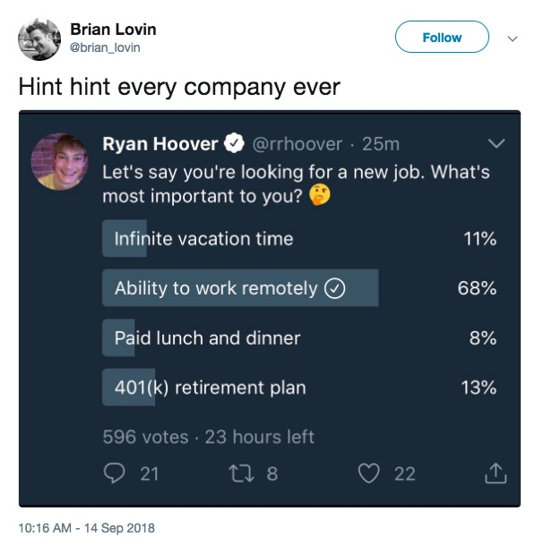
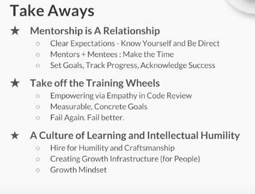

This repo is for various pointers and text relating to development culture and related
thoughts.  It will change and grow.

PH, 9/20/2018

## Impostor syndrome

#### Jacob Kaplan-Moss, Keynote, PyCon 2015 (Montreal)

")

## Helping other developers

#### Sasha Laundy: Your Brain's API: Giving and Getting Technical Help

## Company culture

### Onboarding

Recently I heard someone I respect very highly say "Nobody has time for onboarding."  This was in a conversation
about tech hiring and interviewing.  I couldn't disagree more strongly.  Onboarding is the linchpin
of retention.  If you screw up the first day, the first month, you're much less likely to keep the person
long term.  And employee churn is a very expensive thing.  But don't take it just from me, read the following:

[Employee Onboarding at Startups is Broken.  Here's how to fix it.](http://firstround.com/review/Employee-Onboarding-at-Startups-Is-Broken-Heres-How-to-Fix-It/) (*firstround.com*)

[Successful Onboarding 101: Employee Happiness Begins on Day 1](https://medium.com/@aaronweatherall/successful-on-boarding-101-employee-happiness-begins-on-day-1-df8da455c6c) (*Aaron Weatherall on Medium*)

### Remote work

[Remote work success guide](https://blog.trello.com/remote-work-team-success-guide) (*Trello*)

[IBM's remote work reversal is a losing battle against the new normal](https://www.fastcompany.com/40423083/ibms-remote-work-reversal-is-a-losing-battle-against-the-new-normal) (*Fast Company*)

## Working Life

### Career trajectory

#### How to do it right: mentoring junior engineers at Slack

#### Rethinking the Tech Career Path (What is a Senior Developer?)

")

### Freelancing

[What should a freelance developer charge per hour?](https://insights.dice.com/2018/05/03/freelance-developer-charge-per-hour/) (*Dice Insights*)

[CodeMentor tool mentioned in previous article](https://www.codementor.io/freelance-rates/?ref=producthunt)

## Tools for this page

[Embed YouTube URL in Github Markdown text](http://embedyoutube.org/)
